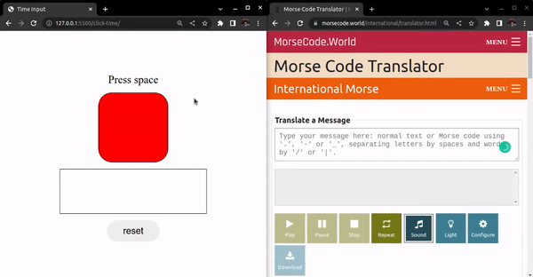

The user input feature here will be implemented on my Morse Code Project.

## Pressing a key:

- Within **0.1s** will display a dot
- More than **0.1s** will display a dash

Not pressing a key with **0.5s** during input will put a space (" ")
